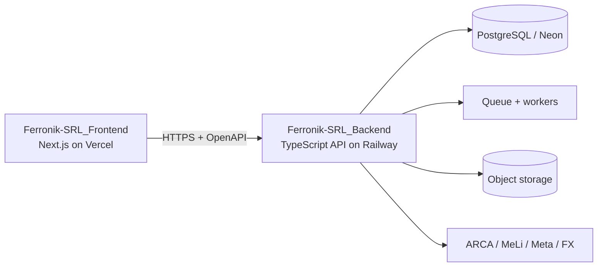

# Architecture

## Decisión principal

Ferronik ERP se implementará como dos aplicaciones independientes y dos repositorios, no como un full-stack Next.js ni un monorepo:



No se crea un tercer repositorio de contratos: el backend publica OpenAPI como artefacto versionado y el frontend genera su cliente desde ese artefacto.

## Stack definitivo

### Frontend

- Next.js estable con App Router, React, TypeScript `strict`, Tailwind CSS y shadcn/ui.
- Server Components para composición/render cuando aporten valor; Client Components para interacción.
- Formularios y previews locales para UX, siempre recalculados/validados por la API.
- Cliente TypeScript generado desde OpenAPI; nunca Prisma ni conexión PostgreSQL.
- Vitest/Testing Library para unidad y Playwright para E2E.
- Deployment en Vercel.

### Backend

- Servicio TypeScript Node.js independiente. Framework HTTP a seleccionar en FASE 1A entre Fastify y NestJS sobre Fastify, priorizando OpenAPI, validación y bajo acoplamiento.
- PostgreSQL administrado inicialmente en Neon y Prisma ORM.
- Servicios de aplicación, dominio independiente e infrastructure adapters.
- API REST JSON documentada con OpenAPI 3.1.
- Proceso web persistente, worker(s) y cron/jobs desplegados inicialmente en Railway.
- Vitest para unidad/integración, PostgreSQL real efímero/Testcontainers y tests de contrato.

No se fijan versiones exactas en FASE 0; cada repositorio tendrá su propio lockfile y CI con versiones estables vigentes al comenzar su fase.

## Fronteras y fuente de verdad

```text
Frontend: presentation -> generated API client
                              |
                              v HTTPS
Backend:  transport -> application -> domain <- infrastructure
                                           |
                                           v
                                      PostgreSQL/adapters
```

- El backend es la única fuente de verdad para pricing, rentabilidad, costos, comisiones, stock, compras, ventas, producción, impuestos, conversiones, cuentas corrientes y permisos.
- El frontend puede calcular previews no autoritativos para respuesta visual; la confirmación usa exclusivamente el resultado recalculado por backend.
- El frontend renderiza capacidades informadas por backend, pero ocultar UI nunca sustituye autorización server-side.
- Sólo el backend conoce `DATABASE_URL`, Prisma y credenciales de integraciones.

## Estructuras previstas

### `Ferronik-SRL_Frontend`

```text
src/
  app/                     # rutas públicas y shell autenticado
  components/ui/           # design system
  components/shared/
  features/                # pantallas y composición por dominio
  api/
    generated/             # cliente generado; no editar manualmente
    client.ts              # transporte, errores y credentials
  auth/                    # consumo de sesión y guards visuales
  lib/
tests/unit/
tests/e2e/
```

### `Ferronik-SRL_Backend`

```text
src/
  transport/http/          # controllers/routes, schemas y OpenAPI
  modules/
    identity/ catalog/ pricing/ inventory/ crm/ sales/ logistics/
    procurement/ production/ ledger/ treasury/ fiscal/
    channels/ documents/ reporting/ notifications/ audit/
      domain/
      application/
      infrastructure/
  workers/                 # outbox y consumidores
  jobs/                    # tareas programadas reentrantes
  shared/                  # DB, env, errors, logging
prisma/schema.prisma
prisma/migrations/
openapi/openapi.json       # artefacto generado/verificado
tests/unit/
tests/integration/
tests/contract/
```

## Contrato API

- OpenAPI 3.1 generado desde las rutas/schemas del backend y validado en CI.
- El backend publica `openapi.json` como artefacto versionado y endpoint de documentación protegido según ambiente.
- El frontend genera un cliente TypeScript determinista; no mantiene DTOs duplicados.
- PRs del backend ejecutan detección de breaking changes contra la versión publicada.
- Cambios compatibles se agregan de forma aditiva. Breaking changes requieren versión mayor/ruta versionada y ventana de migración.
- Frontend CI falla si el cliente generado no coincide con el contrato fijado o si rompe typecheck/tests.

## Convenciones compartidas

- IDs UUIDv7/UUID, timestamps UTC y zona de presentación `America/Argentina/Buenos_Aires`.
- Dinero/cantidades/factores son Decimal; `Money` incluye amount + currency.
- Errores API usan estructura estable con code, message seguro, field errors y correlation ID.
- Mutaciones aceptan idempotency key cuando aplique; eventos externos usan outbox.
- `ProfitabilitySnapshot` agrega productos, logística y otros conceptos con estado `PROVISIONAL|FINAL`.
- Estados comercial, fiscal y logístico son independientes.

## Consistencia y asincronía

- Venta, compra, producción, retiro, pago y transferencia cruzada son transacciones locales del backend.
- Integraciones externas no se ejecutan dentro de transacciones largas: operación + outbox se guardan atómicamente.
- Worker persistente procesa outbox, reintentos y conciliaciones. Cron sólo dispara trabajos idempotentes.
- Webhooks se autentican, persisten por clave idempotente y responden rápido.

## ADR

- ADR-001 (superseded): monolito full-stack Next.js.
- ADR-009: dos repositorios/aplicaciones, frontend y backend, unidos por HTTPS/OpenAPI.
- ADR-010: backend único dueño de DB, autenticación, autorización y reglas de negocio.
- ADR-011: OpenAPI generado; cliente TypeScript derivado, sin DTOs duplicados.
- ADR-012: frontend en Vercel y backend inicialmente en Railway con procesos API/worker/cron.
- ADR-013: no existe repositorio separado de contratos; el backend publica el artefacto.
- ADR-014: subledgers por moneda, logística modelada y rentabilidad histórica versionada se conservan sin cambios.
