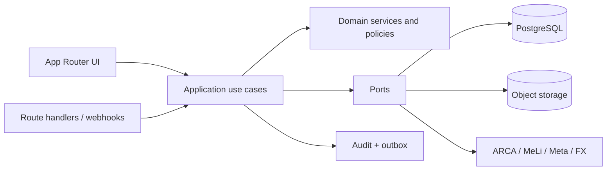

# Architecture

## Stack definitivo

- Web: Next.js estable con App Router, React, TypeScript `strict`, Tailwind CSS y shadcn/ui.
- Backend: Route Handlers para APIs/webhooks, Server Components para lecturas y servicios de aplicación para casos de uso. Server Actions sólo para formularios internos simples.
- Datos: PostgreSQL administrado en Neon; branching para preview y bases separadas para desarrollo/producción.
- ORM: Prisma. Se elige por esquema declarativo, migraciones versionadas, transacciones, tipos generados y buena ergonomía para un dominio relacional grande. Queries críticas podrán usar SQL parametrizado dentro de repositorios.
- Validación: Zod en fronteras; invariantes adicionales en dominio.
- Tests: Vitest (unidad/integración), Testcontainers o PostgreSQL efímero en CI, Playwright (E2E).
- Observabilidad: logs JSON con correlation ID, captura de errores y métricas por proveedor configurable.
- Archivos: object storage S3-compatible mediante `DocumentStorage`.

No se fija una versión exacta de dependencias en FASE 0. FASE 1 las fijará en lockfile usando releases estables vigentes y Node.js soportado por Next.js/Vercel.

## Estilo arquitectónico

Monolito modular desplegado como una aplicación Next.js. Reduce complejidad operativa inicial y conserva fronteras que permiten extraer workers o servicios si la carga lo exige.



Dependencias permitidas: `presentation -> application -> domain`; infrastructure implementa puertos hacia adentro. Componentes React no importan Prisma ni contienen reglas comerciales.

## Estructura prevista

```text
src/
  app/                       # rutas, layouts, route handlers
    (public)/                # login y recuperación
    (erp)/                   # shell privado
    api/                     # APIs y webhooks
  components/
    ui/                      # primitives del design system
    shared/
  modules/
    identity/ catalog/ pricing/ inventory/ crm/ sales/ logistics/
    procurement/ production/ ledger/ treasury/ fiscal/
    channels/ documents/ reporting/ notifications/ audit/
      domain/                # entidades, value objects, políticas
      application/           # casos de uso, DTOs y puertos
      infrastructure/        # repositorios y adapters
      presentation/          # componentes específicos
  lib/                       # DB, auth, env, errors, logging
prisma/
  schema.prisma
  migrations/
  seed.ts
tests/
  unit/ integration/ e2e/
docs/
```

## Convenciones

- IDs UUIDv7/UUID y timestamps UTC; zona de presentación `America/Argentina/Buenos_Aires`.
- DTOs nunca exponen hashes, tokens, costos o márgenes sin permiso.
- Errores tipados: validation, unauthorized, forbidden, conflict, not-found, integration/transient.
- Toda escritura recibe actor, correlation ID e idempotency key cuando aplique.
- Fechas de negocio (`date`) se separan de instantes (`timestamptz`).
- `Money` siempre contiene amount + currency; no se suman monedas diferentes. `ProfitabilitySnapshot` agrega productos, logística, otros ingresos/costos y su estado `PROVISIONAL|FINAL`.
- Sales es dueño del compromiso comercial y Logistics de la entrega. `SaleDelivery` referencia la venta, pero sus estados no cambian implícitamente el estado comercial o fiscal.
- `vercel.json` no se crea mientras defaults de framework alcancen.

## Consistencia y asincronía

- Venta, compra, producción, retiro, pago y transferencia cruzada ejecutan una única transacción local.
- Integraciones externas no se llaman dentro de una transacción larga. Se guarda operación + evento outbox atómicamente y se procesa con reintentos.
- Webhooks se autentican, persisten por clave idempotente y responden rápido; el procesamiento es reentrante.
- Jobs cortos pueden ejecutarse con Vercel Cron/Functions. Cargas largas se delegarán a un proveedor de colas compatible cuando haya requerimiento medido.

## ADR resumidos

- ADR-001: monolito modular antes que microservicios.
- ADR-002: Prisma + PostgreSQL/Neon; runtime Node.js, no Edge, para transacciones previsibles.
- ADR-003: sesiones opacas persistidas, no JWT auto-contenido como fuente de autorización.
- ADR-004: ledger y movimientos append-only.
- ADR-005: adapters para ARCA, Mercado Libre, Meta, FX y storage.
- ADR-006: logística de venta modelada, no un campo genérico; cargo, costo, fiscalidad, dirección y estados poseen integridad y snapshots.
- ADR-007: subledgers por moneda; equivalentes consolidados son proyecciones informativas, nunca saldo fuente.
- ADR-008: rentabilidad histórica versionada y explícitamente provisional o final.
