# Database Model

## Principios

- PostgreSQL es la fuente de verdad.
- `numeric(19,4)` para dinero, `numeric(20,8)` para cantidades/factores y `numeric(20,10)` cuando una conversión lo requiera. La escala concreta se valida por concepto.
- Cada importe incluye moneda; cada conversión histórica guarda tasa, fuente y fecha.
- Entidades operativas usan `created_at`, `updated_at`, `created_by` y control de concurrencia (`version`).
- Restricciones, claves foráneas, checks e índices complementan validación de aplicación.

## Mapa de entidades

```mermaid
erDiagram
  USER ||--o{ SESSION : owns
  USER }o--o{ ROLE : assigned
  ROLE }o--o{ PERMISSION : grants
  USER }o--o{ PERMISSION : overrides
  CUSTOMER ||--o{ QUOTE : requests
  CUSTOMER ||--o{ SALE : buys
  CUSTOMER ||--|| CUSTOMER_ACCOUNT : has
  PRODUCT ||--o{ PRODUCT_VARIANT : groups
  PRODUCT_VARIANT ||--o{ UNIT_CONVERSION : converts
  PRICE_LIST ||--o{ PRICE_LIST_ITEM : contains
  PRODUCT_VARIANT ||--o{ INVENTORY_MOVEMENT : moves
  WAREHOUSE ||--o{ INVENTORY_MOVEMENT : records
  SALE ||--|{ SALE_ITEM : contains
  SALE ||--o{ PAYMENT_ALLOCATION : paid_by
  SALE ||--o{ STOCK_RESERVATION : reserves
  SALE ||--o{ STOCKPILE : creates
  STOCKPILE ||--o{ STOCKPILE_WITHDRAWAL : withdraws
  SUPPLIER ||--o{ PURCHASE : supplies
  PURCHASE ||--|{ PURCHASE_ITEM : contains
  PURCHASE_ITEM ||--o{ PURCHASE_COST_COMPONENT : costs
  CUSTOMER_ACCOUNT ||--o{ LEDGER_ENTRY : posts
  SUPPLIER ||--o{ SUPPLIER_ACCOUNT : owns
  SUPPLIER_ACCOUNT ||--o{ LEDGER_ENTRY : posts
  CASH_ACCOUNT ||--o{ CASH_MOVEMENT : posts
  PRODUCTION_ORDER ||--o{ PRODUCTION_CONSUMPTION : consumes
  PRODUCT_VARIANT ||--o{ BOM_ITEM : component
  DOCUMENT ||--o{ DOCUMENT_LINK : attaches
  OUTBOX_EVENT ||--o{ INTEGRATION_ATTEMPT : delivers
  USER ||--o{ AUDIT_LOG : acts
```

## Agregados y tablas clave

### Identity

`users`, `credentials`, `sessions`, `password_reset_tokens`, `roles`, `permissions`, `user_roles`, `role_permissions`, `user_permission_overrides`. Email y username normalizados son únicos. Tokens sólo como hashes. Un usuario deshabilitado invalida sesiones activas.

### Catálogo y precios

`products`, `product_variants`, `categories`, `families`, `brands`, `units`, `unit_conversions`, `price_lists`, `price_list_items`, `customer_price_lists`, `price_history`, `cost_history`. Conversiones tienen vigencia; cada línea operativa guarda factor snapshot.

### Inventario

`warehouses`, `inventory_movements`, `stock_reservations`, `stockpiles`, `stockpile_items`, `stockpile_withdrawals`, `stockpile_withdrawal_items`. No se guarda un saldo editable como verdad: se deriva/proyecta desde movimientos y reservas. Una tabla de proyección puede optimizar lecturas y se reconstruye.

### Ventas y CRM

`customers`, `customer_contacts`, `quotes`, `quote_items`, `crm_activities`, `sales`, `sale_items`, `sale_adjustments`, `commissions`, `delivery_notes`, `receipts`, `payments`, `payment_allocations`. Líneas guardan neto, impuesto, total, costo, factor fiscal/comercial, conversión, FX y regla de redondeo.

### Compras

`suppliers`, `purchases`, `purchase_items`, `purchase_cost_components`, `supplier_credit_notes`, `supplier_credit_note_allocations`. Cada compra define segmentos documentado/comercial con pesos cuya suma debe ser 1; no se duplica proveedor.

### Ledgers y tesorería

`accounts`, `ledger_transactions`, `ledger_entries`, `cash_accounts`, `cash_movements`, `checks`, `expense_obligations`, `expense_payments`, `cross_transfers`. Cada transacción balancea débitos/créditos según el subledger. La transferencia cruzada comparte `operation_id`, afecta ambos subledgers y no crea movimiento de caja.

### Producción

`boms`, `bom_items`, `production_orders`, `production_consumptions`, `production_outputs`. Consumos y output generan movimientos ligados; costo resultante guarda componentes y criterio de asignación snapshot.

### Integraciones y gobierno

`fiscal_documents`, `integration_connections`, `webhook_receipts`, `idempotency_keys`, `outbox_events`, `integration_attempts`, `documents`, `document_links`, `notifications`, `audit_logs`, `settings`, `setting_versions`.

## Invariantes críticas

- `available = physical - reserved`; no puede consumirse reservado sin permiso/override auditado.
- Retiro acumulado de acopio no supera cantidad adquirida.
- Imputaciones de pago no superan el importe aplicable; saldo a favor es un asiento, no un número manual.
- Pesos de compra mixta suman exactamente 1.
- Un idempotency key es único por actor/integración + operación.
- Estados se validan con máquinas de estado; no se actualizan libremente.
- Eliminación física prohibida para operaciones contabilizadas; se anulan/revierten.

## Índices iniciales

- Identidades normalizadas (`lower(email)`, `lower(username)`), CUIT y SKU.
- Búsquedas por cliente/producto con `pg_trgm` cuando esté disponible.
- Fechas/estado para ventas, compras, cheques, obligaciones, quotes y notificaciones.
- `(warehouse_id, product_variant_id, occurred_at)` para movimientos.
- `(account_id, occurred_at, id)` para ledger.
- `(aggregate_type, aggregate_id)` en auditoría/outbox/document links.
- Índices parciales para sesiones activas, outbox pendiente y alertas abiertas.

## Migraciones

Prisma Migrate genera SQL versionado. Desarrollo usa `migrate dev`; CI valida drift; producción ejecuta `migrate deploy` como paso separado y controlado antes de promover código. Cambios incompatibles siguen expand/migrate/contract y nunca dependen del rollback de frontend.
