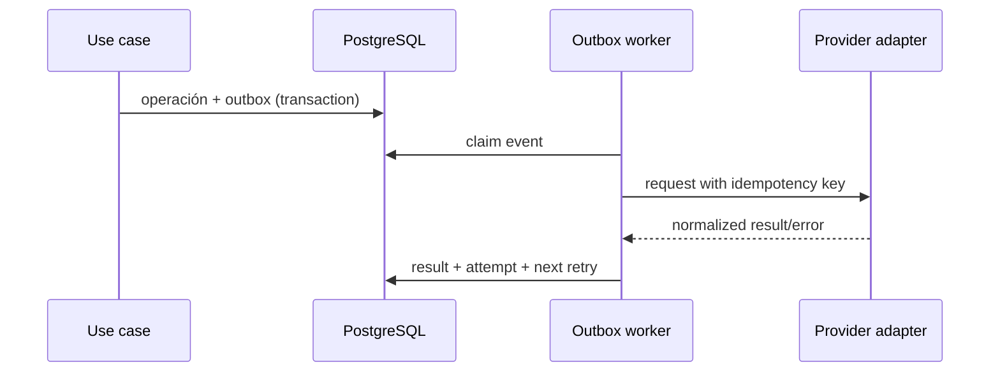

# Integrations

## Patrón común

Cada integración implementa un puerto del application layer. El core opera con modelos propios; DTOs externos se traducen en adapters. Credenciales, endpoints y modo (`disabled`, `sandbox`, `production`) son configuración por ambiente.

## ARCAProvider

Contrato: validar datos fiscales, solicitar autorización, consultar estado y recuperar metadatos. Estados `NOT_REQUIRED`, `PENDING`, `PROCESSING`, `AUTHORIZED`, `REJECTED`, `RETRY_REQUIRED`. CAE, vencimiento, request/response sanitizados y certificado usado quedan trazables. Certificado/clave se cargan como secretos, nunca en DB o Git. Preview usa `disabled` o homologación aislada; jamás producción.

## MercadoLibreProvider

OAuth oficial, webhooks verificados y sincronización incremental. Se normalizan órdenes, publicaciones, pagos, fees, envíos, Flex, promociones e impuestos. Cada liquidación conserva raw payload protegido + snapshot normalizado. Conciliación compara esperado vs liquidado; tarifas actuales no recalculan historia.

## MessagingProvider

Puerto para WhatsApp/Instagram/Facebook mediante APIs Meta oficiales. Envía plantillas/documentos permitidos y registra estado, conversación, cliente, entidad relacionada y provider message ID. No scraping. Consentimiento y ventana de mensajería se validan según política vigente.

## CurrencyRateProvider

Obtiene dólar divisa de fuente configurable, devuelve tasa, timestamp y fuente. Overrides requieren permiso/motivo. Fallback manual explícito; nunca reutiliza silenciosamente una tasa vencida.

## DocumentStorage

Operaciones: iniciar upload, completar/verificar, firmar download y borrar lógicamente. Bytes en S3-compatible/Blob; PostgreSQL guarda metadata, checksum, owner, clasificación y links. Límites MIME/tamaño, antivirus asíncrono y URLs de vida corta.

## Resiliencia e idempotencia

- Unique keys para webhook/evento/proveedor.
- Timeouts, reintentos exponenciales con jitter y máximo; errores permanentes no se reintentan.
- Dead-letter/revisión manual con alerta.
- Circuit breaker sólo si métricas justifican complejidad.
- Logs con correlation ID y payloads redactados.

## Estado por fase

| Integración | Fase | Estado actual |
| --- | --- | --- |
| Email | 1 | NOT IMPLEMENTED |
| Storage | 1/según documentos | NOT IMPLEMENTED |
| ARCA | 10 | NOT IMPLEMENTED |
| Mercado Libre | 11 | NOT IMPLEMENTED |
| Meta/WhatsApp | 12 | NOT IMPLEMENTED |
| Currency provider | 2/9 | NOT IMPLEMENTED |
